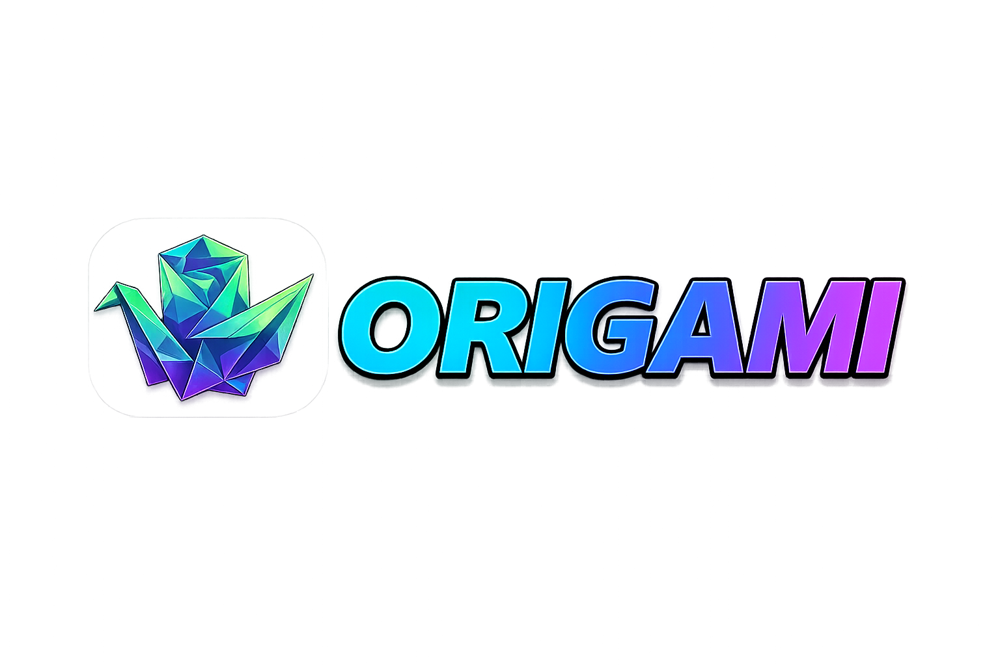

<div align="center">
  

  <h3>Turn PDF slides into narrated videos — entirely in your browser.</h3>
  <p>AI-written narration, local text-to-speech, in-browser FFmpeg rendering, and smart screen recording. No upload, no render farm, no subscription.</p>

  <p>
    <a href="https://github.com/TechMitten/Origami-AI/stargazers"></a>
    <a href="https://github.com/TechMitten/Origami-AI/issues"></a>
    <a href="LICENSE"></a>
    <a href="https://nodejs.org/"></a>
    <a href="https://github.com/TechMitten/Origami-AI/pulls"></a>
  </p>

  <p>
    <a href="#-quick-start"><strong>Quick Start</strong></a> ·
    <a href="#-features">Features</a> ·
    <a href="#-how-it-works">How It Works</a> ·
    <a href="#-configuration">Configuration</a> ·
    <a href="CONTRIBUTING.md">Contributing</a>
  </p>
</div>

---

## What is Origami AI?

Upload a PDF deck, and Origami AI extracts the slides, writes a narration script with an LLM, voices it with local text-to-speech, and renders a finished MP4 — using [WebLLM](https://github.com/mlc-ai/web-llm), [Kokoro.js](https://github.com/Kokoro-js), and [FFmpeg.wasm](https://github.com/ffmpegwasm/ffmpeg.wasm) running directly in your browser via WebGPU. The Express/Cloudflare server only proxies optional cloud LLM calls so API keys never reach the client bundle — your slides, audio, and video never have to leave your machine.

It also doubles as a screen recorder with cinematic auto-zoom, an MP4 scene analyzer, and an AI assistant chat.

|  | Traditional video editors | Cloud AI services | **Origami AI** |
|---|---|---|---|
| Learning curve | Steep | Easy | **Minimal — automated** |
| Privacy | Local | Cloud-based | **Local-first** |
| Cost | One-time / free | Pay-per-minute or credits | **Free & open source** |
| Voice | Your own / hire talent | Pay per minute | **Unlimited local TTS** |
| Time to video | Hours | Minutes | **~10–30 min** |

## ✨ Features

- 🎬 **AI narration scripts** — generated locally with WebLLM, or via Gemini/OpenAI-compatible APIs
- 🎙️ **In-browser TTS** — Kokoro.js with multiple voices, no server round-trip
- ⚡ **WebGPU acceleration** — for both narration generation and the AI assistant
- 📹 **In-browser rendering** — FFmpeg.wasm composes slides, audio, music, and pan/zoom into a 720p/1080p MP4
- 🎯 **Smart screen recording** — auto-zoom on idle, with an optional Chrome extension for richer cursor/DOM telemetry
- 🔍 **Scene-aware video analysis** — turn an MP4 into a timestamped scene breakdown
- 💬 **AI assistant chat** — local WebLLM models or cloud fallback, with image/video attachments
- 🐛 **Issue reporter** — record a bug, get an AI-generated debugging writeup
- 🔒 **Server-side key proxying** — `LLM_API_KEY` never ships in the production client bundle
- 🎵 **Background music & mixing** — auto-ducking under narration with per-slide control
- 📦 **Portable projects** — export/import a full project (slides, media, audio, settings) as a `.origami` archive

## 🚀 Quick Start

**Requirements:** Node.js ≥ 20.19.0 and a [WebGPU-capable browser](#browser-support).

```bash
git clone https://github.com/TechMitten/Origami-AI.git
cd Origami-AI
npm install
npm run dev
```

Open **http://localhost:3000**.

> [!IMPORTANT]
> Don't open `index.html` directly. The dev server sets the COOP/COEP headers that `SharedArrayBuffer`/FFmpeg.wasm need — without them, rendering and TTS init silently fail.

| Command | Purpose |
|---|---|
| `npm run dev` | Express + Vite dev server with HMR |
| `npm run build` | Production build → `dist/` |
| `npm run preview` | Serve the production build |
| `npm run lint` | Lint plain `.js` files (see note below) |
| `npm run stop` | Kill whatever is on port 3000 |

<details>
<summary><strong>Run with Docker instead</strong></summary>

```bash
docker compose up --build
```

Available at **http://localhost:3000**.
</details>

<details>
<summary><strong>Optional: install the Chrome extension</strong></summary>

The extension adds DOM-level cursor/click/scroll telemetry for more precise auto-zoom during screen recording. Origami AI works without it via an in-page fallback.

1. Open `chrome://extensions`
2. Enable **Developer mode**
3. Click **Load unpacked** → select the `chrome-extension/` folder

You can also download a packaged ZIP from inside the app (header menu → **Download Chrome Extension**, or Slide Editor → *Slide Media* tab). See [chrome-extension/README.md](chrome-extension/README.md) for details.
</details>

## 🧭 How It Works

**Primary flow — PDF → video:**

1. Upload a PDF; slide images and text are extracted automatically
2. An LLM (local WebLLM or a remote API) drafts a narration script per slide
3. Kokoro.js synthesizes speech for each script
4. Edit scripts, timing, transitions, and music in the visual editor
5. FFmpeg.wasm renders a 720p/1080p MP4, fully in-browser
6. Download the finished video

Typical end-to-end time is 10–30 minutes, depending on slide count and GPU.

**Other entry points:**
- **Screen recording** — capture a tab or desktop, auto-zoom on idle (>2s), combine with PDF slides or use standalone
- **Scene analysis** — upload an MP4, get a timestamped scene breakdown via the Gemini API
- **AI assistant chat** — ask questions, attach images/video, local or cloud models
- **Issue reporter** — record a bug, get an AI-generated analysis and debugging suggestions

## ⚙️ Configuration

Open the app and click **⚙️ Settings** for:

| Tab | Controls |
|---|---|
| General | Intro fade timing, post-audio delay, default transition, recording options |
| TTS Model | Kokoro.js quantization (`q4` quality vs. `q8` speed) |
| WebLLM | Enable/disable local AI, model selection, precision filter (f16/f32) |
| API | Remote OpenAI-compatible provider (Gemini, OpenRouter, Ollama, etc.) |
| AI Prompt | Narration script generation behavior |

### API keys: dev vs. production

Origami AI works with **zero API keys** via local WebLLM. Cloud APIs (Gemini, OpenAI-compatible) are optional, for narration, video analysis, and issue reporting.

```bash
cp .env.example .env
```

```env
# Dev only — Vite bakes VITE_-prefixed vars into the client bundle
VITE_LLM_API_KEY=your_api_key_here
VITE_LLM_BASE_URL=https://generativelanguage.googleapis.com/v1beta/openai/
VITE_LLM_MODEL=gemini-flash-latest
```

In **production**, set `LLM_API_KEY` (no `VITE_` prefix) on the server/host instead. The client detects there's no client-side key and automatically routes calls through the server proxy (`POST /api/llm/chat`, `/api/llm/analyze-video`, `/api/llm/analyze-issue`) so the key never reaches the browser.

> [!WARNING]
> Never set `VITE_LLM_API_KEY` in production — anything with the `VITE_` prefix is compiled into the public client bundle.

<details>
<summary><strong>Full environment variable reference</strong></summary>

| Variable | Context | Purpose |
|---|---|---|
| `VITE_LLM_API_KEY` | Client (dev only) | Exposes the API key to the browser for development. **Never set in production.** |
| `LLM_API_KEY` | Server (prod) | Server-side key used by the proxy endpoints; never sent to the client. |
| `VITE_LLM_BASE_URL` | Client | OpenAI-compatible endpoint base URL |
| `VITE_LLM_MODEL` | Client | Model identifier (e.g. `gemini-flash-latest`) |
| `CLIENT_URL` | Server | Comma-separated allowed CORS origins |
| `PORT` | Server | Port to listen on (default `3000`) |
| `NODE_ENV` | Server | Set to `production` for production builds |

</details>

## 🖥️ Requirements

- **Node.js** ≥ 20.19.0
- A WebGPU-capable browser (below) — required for local narration generation, the AI assistant, and zoom effects during screen recording. Without it, fall back to a remote OpenAI-compatible API.
- A stable connection for first-run model downloads (roughly 1–5GB depending on models chosen)

<details>
<summary><strong>Browser support</strong></summary>

| Browser | Min. version | Notes |
|---|---|---|
| Chrome / Chromium | 113+ | Chrome extension available for enhanced recording |
| Edge | 113+ | Chrome extension available for enhanced recording |
| Firefox | Nightly | Enable `dom.webgpu.enabled` in `about:config` |
| Safari | 18+ (macOS Sonoma) | Desktop recording supported |

</details>

<details>
<summary><strong>System specs & model sizes</strong></summary>

**Minimum** — 4-core CPU, 8GB RAM, integrated GPU (expect 1–2 hours for first-run downloads + rendering)
**Recommended** — 8-core CPU, 16GB RAM, dedicated GPU with F16 support, NVMe SSD

AI assistant chat model options:

| Model | Download | VRAM |
|---|---|---|
| Gemma 2 2B | 1.4GB | ~2GB |
| Llama 3.2 1B | 800MB | ~1.5GB |
| Llama 3.2 3B | 1.7GB | ~2.5GB |
| Phi 3.5 Vision | 3.9GB | ~4GB (adds image/video analysis) |

</details>

## 🏗️ Tech Stack

<details>
<summary><strong>Frontend, core libraries, and backend</strong></summary>

**Frontend** — React 19 + TypeScript, Vite 7, Tailwind CSS 4, React Router 7

**Core libraries**
- [`@mlc-ai/web-llm`](https://github.com/mlc-ai/web-llm) — local LLM inference for narration and chat
- [`@ffmpeg/ffmpeg`](https://github.com/ffmpegwasm/ffmpeg.wasm) — in-browser video rendering
- [`pdfjs-dist`](https://mozilla.github.io/pdf.js/) — PDF text/image extraction
- [`kokoro-js`](https://github.com/Kokoro-js) — text-to-speech
- [`@dnd-kit`](https://docs.dndkit.com) — drag-and-drop slide reordering

**Backend** — Express 5 + TypeScript (`server.ts`), with a parallel Cloudflare Pages Functions implementation (`functions/`) for the Wrangler deployment target. See [CLAUDE.md](CLAUDE.md) for why both exist and how they need to stay in sync.

**Chrome extension** — plain JS Manifest V3, MessagePort-based telemetry, optional

</details>

### Project structure

```
src/
├── components/      # React UI components
├── pages/           # Routed pages (AssistantPage, IssueReporterPage, ...)
├── services/        # Business logic — aiService, webLlmService, ttsService,
│                     #   BrowserVideoRenderer, storage, projectArchiveService
├── hooks/           # Custom React hooks
├── context/         # React context providers
└── utils/           # Helpers
```

`App.tsx` owns most cross-cutting state for the editor flow; `SlideEditor.tsx` is the main per-slide editing surface (Overview, Voice Settings, Audio Mixing, Batch Tools, Slide Media tabs).

## 🐛 Troubleshooting

See [TROUBLESHOOTING.md](TROUBLESHOOTING.md) for the full guide. Quick fixes:

| Symptom | Try |
|---|---|
| WebGPU not detected | Enable hardware acceleration, update GPU drivers, switch to a supported browser |
| FFmpeg / dev server errors | Run via `npm run dev` — never open `index.html` directly |
| Model download failures | Check connection stability, clear browser cache, verify storage permissions |
| Out of memory | Use a smaller model, close background apps, lower export resolution |
| COOP/COEP warnings | Confirm the dev server (not a static file) is serving the app |

## 🤝 Contributing

Contributions are welcome — see [CONTRIBUTING.md](CONTRIBUTING.md) for setup, coding standards, commit conventions, and the PR process.

When reporting a bug, please include your browser + version, OS, `node -v`, repro steps, and any console output. File issues at [GitHub Issues](https://github.com/TechMitten/Origami-AI/issues).

## 📄 License

Licensed under the [PolyForm Noncommercial License 1.0.0](LICENSE).

## 🙏 Credits

[WebLLM](https://github.com/mlc-ai/web-llm) · [Kokoro.js](https://github.com/Kokoro-js) · [FFmpeg.wasm](https://github.com/ffmpegwasm/ffmpeg.wasm) · [PDF.js](https://mozilla.github.io/pdf.js/) · [React](https://react.dev) · [Tailwind CSS](https://tailwindcss.com) · [Lucide](https://lucide.dev) · [dnd-kit](https://docs.dndkit.com)

---

<div align="center">

<a href="#-quick-start">⬆ Back to top</a>

Made with ❤️ by TechMitten LLC

</div>
